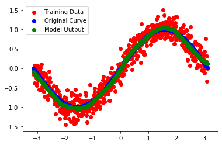

yyml
====

A C++ machine learning library implement from scratch.

Already implemented and will be implementing:
- Tensor and TensorViewer (done).
- Linear algebra algorithms.
- Neural network. (done)
- Other ML algorithms.

Some Demo
---

